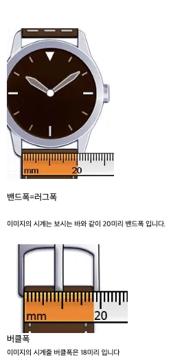
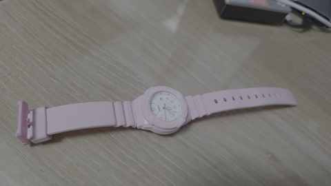

# 2026-10-07 Casio LRW-200H-4B2 시계줄 규격 조사 및 색상별 3개 구매

## 기본정보

| 항목 | 내용 |
|---|---|
| 기록일 | 2026-10-07 |
| 프로젝트 | 연서 |
| 공개 범위 | 공개 아카이브 |
| 대상 시계 | Casio LRW-200H-4B2 |
| 판매명 식별 | `LRW-200H-4B2 200 핑크B2 / 카시오 회전베젤 다이버 학생 여자 우레탄 손목시계` |
| 시계줄 러그폭 | **14 mm** |
| 시계줄 어깨폭 | **18 mm** |
| 구매처 | AliExpress |
| 구매 수량 | **총 3개** |
| 구매 구성 | **색상별 1개씩 3개** |

## 핵심 요약

Casio LRW-200H-4B2 핑크 시계의 교체용 시계줄을 조사했다. 실제 장착 규격은 러그폭 14 mm, 어깨폭 18 mm로 정리했으며, AliExpress에서 호환 시계줄을 색상별로 총 3개 구매했다.

공개본에는 주문번호, 주문상세 URL, 배송정보처럼 구매자를 식별할 수 있는 정보는 넣지 않는다. 구매한 3개의 정확한 옵션 색상명은 현재 공개 가능한 기록에서 확인되지 않아 임의로 작성하지 않았다.

## 규격 정리

| 구분 | 확인값 | 비고 |
|---|---:|---|
| 모델 | LRW-200H-4B2 | 핑크 B2 모델 |
| 러그 안쪽 폭 | 14 mm | 교체줄 연결부 핵심 규격 |
| 어깨폭 | 18 mm | 러그 바깥쪽으로 넓어지는 부분 |
| 소재 계열 | 우레탄/레진 | 원래 시계의 밴드 계열 |
| 색상 식별 | 4B2 / Pink B2 | `4B2`는 모델 식별용 색상 접미 표기이며 HEX 색상코드로 확정하지 않음 |

## 구매 기록

| 항목 | 내용 |
|---|---|
| 구매일 | 2026-10-07 |
| 판매처 | AliExpress |
| 수량 | 3개 |
| 선택 방식 | 색상별 구매 |
| 주문 상세 | 공개본 미수록 — 주문번호가 포함된 개인 구매 식별 URL |
| 현재 상태 | 구매 완료 |

## 경과

1. LRW-200H-4B2 핑크 모델의 교체용 시계줄을 찾기 시작했다.
2. 시계줄 규격을 **러그 14 mm / 어깨 18 mm**로 확정했다.
3. 모델 표기는 `LRW-200H-4B2`, 판매명에는 `핑크B2`가 사용됨을 확인했다.
4. 호환 시계줄을 조사한 뒤 AliExpress에서 **색상별 총 3개**를 구매했다.
5. 공개 아카이브에는 주문번호·주문 상세주소 등 구매 식별정보를 제외하기로 했다.

## 이미지

### 1. 밴드폭·버클폭 측정 예시 이미지

이 이미지는 시계줄 폭을 어디에서 측정하는지 이해하기 위한 참고 이미지다. 실제 교체 규격은 위 표의 **러그 14 mm / 어깨 18 mm**를 기준으로 한다.

### 2. Casio LRW-200H-4B2 핑크 시계

핑크 레진 케이스와 밴드가 장착된 실물 시계 사진이다.

## 공개 기록 원칙

- 주문번호, 주문상세 URL, 배송지, 결제정보는 공개 저장소에 올리지 않는다.
- 사용자 제공 실물 사진과 규격 확인 자료만 공개한다.
- 구매한 3개 색상의 정확한 옵션명은 확인 전까지 추정해서 기재하지 않는다.
- 이후 실제 수령 후 색상·장착 상태를 확인하면 같은 기록에 수령 결과를 추가할 수 있다.

## 원본 파일

| 파일 | 유형 | 설명 |
|---|---|---|
| `images/01-band-size-guide.webp` | WEBP | 밴드폭·버클폭 측정 참고 이미지(웹 최적화본) |
| `images/02-casio-lrw200h-4b2-pink-watch.jpg` | JPEG | LRW-200H-4B2 핑크 실물 사진(웹 최적화본) |

## 다운로드

- [웹 아카이브 ZIP](downloads/20261007_Casio_LRW200H_4B2_시계줄_구매기록_WEB.zip)
